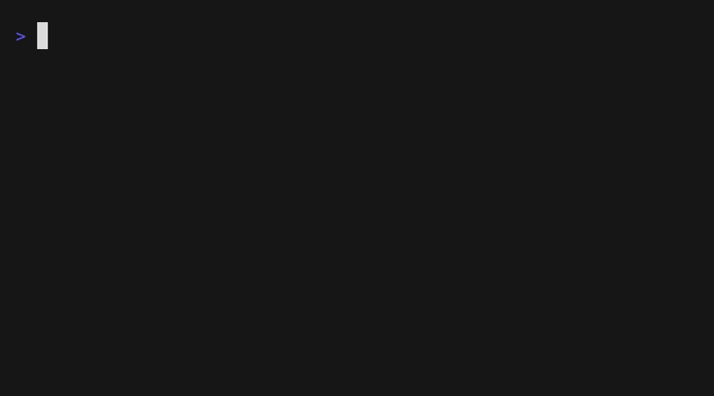
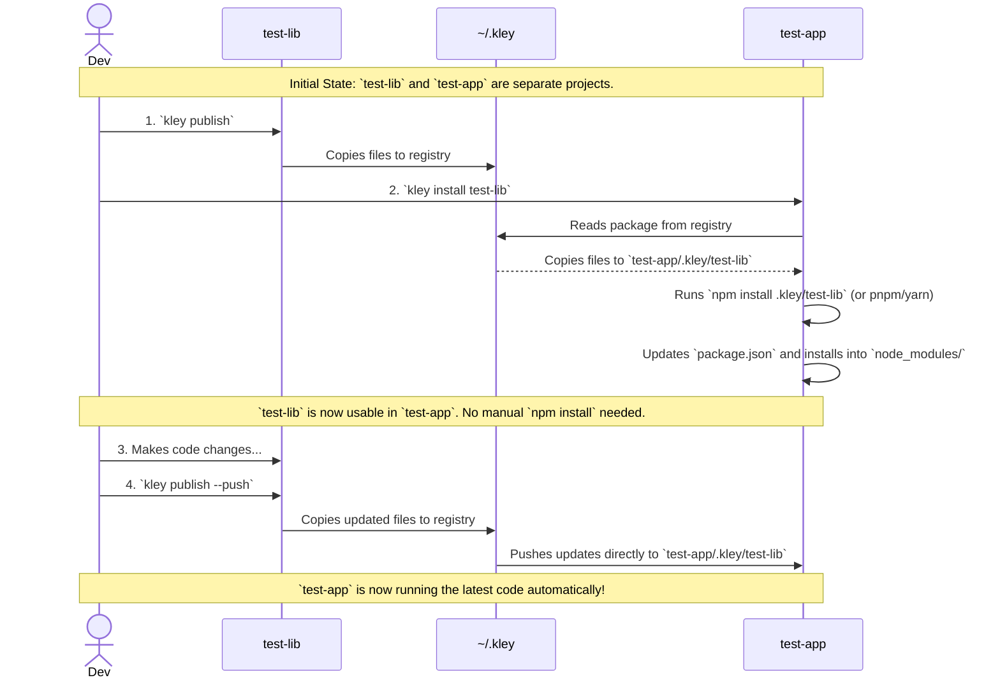
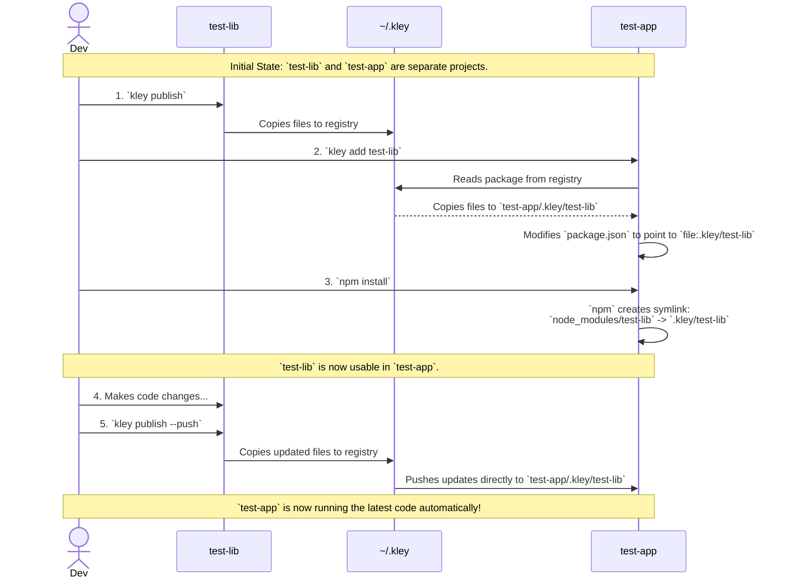
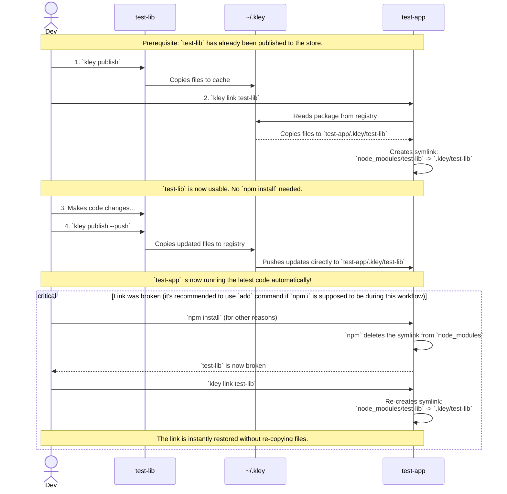

# 📦 kley

[](https://github.com/sumbad/kley/releases)
[](#installation)
[](https://www.npmjs.com/package/kley-cli)
[](https://crates.io/crates/kley)
[](./LICENSE)

English | [Русский](./README_RU.md)

**The simple local package manager for npm (JS/TS)**

> Like **`npm link`**, but with a more convenient workflow. Like **`yalc`**, but without the dependency on Node.js.

**kley** is a command-line tool that simplifies local development of npm packages. It provides a robust alternative to `npm link` by managing a local package store. It saves packages to a central cache on your machine when you "publish" and lets you quickly install them into your local projects via direct file copying or symlinks, without needing to connect to a remote repository.

## Key Features

- **Fast and Efficient**: All operations are local, with no network latency or unnecessary publishing of intermediate versions.
- **Reliable and Independent**: Avoids `npm link` issues and works even if your library and projects use different versions of Node.js.
- **Safe by design**: Works with files directly, minimizing package script execution.
- **Simple API**: Two core commands to get started: `publish` and `install`.
- **Cross-Platform**: Works on macOS, Linux, and Windows.

## Getting started

If your goal is simply to use a locally built package, two commands are enough: `publish` and `install`. Let's walk through the basic scenario:

**Steps:**
1. In your **library** directory — run `kley publish`: copies package files to `kley` registry.
2. In your **project** directory — run `kley install <name>`: copies files to `.kley/`, updates `kley.lock`, and automatically runs the native package manager to install the package into `node_modules/`.
3. Make changes in your library, then run `kley publish --push`: updates all linked projects.



<details>
<summary>Schema with details</summary>

The diagram below shows the key steps: publishing, installing the dependency, and then pushing an update.


</details>


<details>
<summary>If you need more control, here are two alternative workflows</summary>


### Scenario 1: Robust Workflow `publish->add->npm i`

This is a more controlled workflow. It's perfect for when you prefer the traditional `npm install` flow, but want to move faster without publishing to a remote repository.

**Steps:**
1. In your **library** directory — run `kley publish`: copies package files to `kley` registry.
2. In your **project** directory — run `kley add <name>`: copies files to `.kley/` and updates `package.json`.
3. Run `npm install`, npm creates `node_modules/<name>` from `.kley/<name>`.
4. Make changes in your library, then run `kley publish --push`: updates all linked projects. Or just `kley publish`, but in this case you'll also need to run `kley update` in the project directory to get the changed version.
5. Run `npm install`. You can now use the **project** with the updated **library**.


<details>
<summary>Schema with details</summary>

The diagram below shows the key steps: publishing, adding the dependency, and then pushing an update.


</details>

### Scenario 2: Rapid Iteration with `publish->link`

This workflow is ideal for quick, temporary testing when you don't want to modify `package.json`. It's faster because it skips the `npm install` step but is less durable.

**Steps:**
1. In your **library** directory — run `kley publish`: copies package files to `kley` registry.
2. In your **project** directory — run `kley link <name>`: copies files to `.kley/` and creates a symlink
   directly in `node_modules/<name>` — **no `npm install` needed**
3. Make changes in your library, then run `kley publish --push`: updates the project automatically

> ⚠️ **Note:**: If you run `npm install` for any reason, it will delete the symlink. Restore it instantly with `kley link <name>` again — files are already cached, so it's fast.


<details>
<summary>Schema with details</summary>

This diagram shows how `kley link` provides a direct connection and how it can be "broken" and "repaired."



</details>

### **Quick pick:** Not sure which workflow to use?

| | Scenario 1 `publish→add→npm i` | Scenario 2 `publish→link` |
|---|---|---|
| Best for | Stable, ongoing development | Quick, temporary testing |
| Modifies `package.json` | Yes | No |
| Requires `npm install` | Yes | No |
| Survives `npm install` | Yes | No. Run `kley link` again |

</details>

## Installation

### Quick Install (recommended)

You can install `kley` with a single command using the installer script:

```bash
# Linux / macOS
curl --proto '=https' --tlsv1.2 -LsSf https://github.com/sumbad/kley/releases/latest/download/kley-installer.sh | sh
```
```bash
# Windows
powershell -ExecutionPolicy Bypass -c "[Net.ServicePointManager]::SecurityProtocol = [Net.SecurityProtocolType]::Tls12; irm https://github.com/sumbad/kley/releases/latest/download/kley-installer.ps1 | iex"
```

### Manual Installation

Alternatively, you can install `kley` by downloading a pre-compiled binary from the [**Releases page**](https://github.com/sumbad/kley/releases).

1.  Download the appropriate archive for your system (e.g., `kley-x86_64-apple-darwin.tar.gz`).
2.  Unpack the archive.
3.  Move the `kley` binary to a directory in your system's `PATH` (e.g., `/usr/local/bin` on macOS/Linux).

### Install via npm (kley-cli)
⚠️ **Note:** The npm package wraps the `kley` binary and requires Node.js to run.
If your library and consuming project use **different Node.js versions**, prefer the [binary installer](#quick-install-recommended) or Cargo install instead.

```bash
npm install -g kley-cli
```

### Install via Cargo (crates.io)
If you have Rust and Cargo installed, you can install `kley` directly from crates.io:

```bash
cargo install kley
```

## Usage

### 1. `kley publish`
Run this command in the directory of the package you want to share locally. Kley copies all necessary files to a central store at `~/.kley/packages/<your-package-name>`.

- Use the `--push` flag to automatically update the package in all projects where it has been added or linked. This is the primary command for a fast, iterative workflow.

### 2. `kley unpublish`
Run this command in the directory of a published package to remove it from the kley store.

- By default, it performs a "soft" unpublish, removing the package from the store but leaving your projects intact until the next install.
- Use the `--push` flag to perform a "hard" unpublish, which also removes the package from all projects that use it.

### 3. `kley install <package-name>` (alias `i`)
A universal command that combines `add` and the native package manager installation. It automatically detects whether your project uses `npm`, `pnpm`, or `yarn`, copies the package to `.kley/`, updates `kley.lock`, and delegates the installation to the appropriate package manager — all in one go.

- Supports `npm`, `pnpm`, and `yarn` out of the box.
- To explicitly specify the package manager, set the `packageManager` value in `package.json` or `kley.lock`.
- **Lifecycle scripts** (`preinstall`, `install`, `postinstall`) are **disabled by default** (`--ignore-scripts`) for safety. This prevents arbitrary code execution during install. If a package requires lifecycle scripts to function (e.g., native modules), run the package manager manually.

> **Note:** If you need to add a package as a dev dependency (`--dev`), use `kley add --dev` instead and run the package manager manually.

### 4. `kley add <package-name>`
Run this command in the project where you want to use your local package. Kley copies the package into a local `./.kley/` directory, then automatically updates your `package.json` and `kley.lock`.

- Use the `--dev` flag to add the package to `devDependencies`.

> **Note:** For the changes to appear in `node_modules`, you must run `npm install` (or `yarn`, `pnpm`) after `kley add`. For a one-step alternative, use `kley install`.

### 5. `kley link <package-name>`
This command provides a flexible workflow that avoids modifying `package.json`. It copies the package to a local `.kley` cache and then creates a symbolic link from that cache to your project's `node_modules` directory.

> **Warning:** Because `package.json` is not modified, running `npm install` (or `yarn`, `pnpm`) will likely delete the symlink from `node_modules`. To restore it, simply run `kley link <package-name>` again. This is a fast operation because the local cache is preserved.

### 6. `kley update [package-name]`
This command updates installed packages to the latest version from the kley store.

- If you provide a package name, only that specific package will be updated.
- If you run it without arguments, `kley` will update all packages listed in `kley.lock`.

### 7. `kley remove [package-name]`
Run this command to cleanly remove a kley-managed dependency from your project. It will update `package.json` and `kley.lock`, and delete the package files from the `./.kley/` directory.

- Use the `--all` flag to remove all kley-managed packages from the project.

## Environment Variables

| Variable | Default | Description |
|---|---|---|
| `KLEY_HOME` | `~` (home directory) | The directory where kley stores its registry (`$KLEY_HOME/.kley/`). By default, kley uses your system's home directory. Override this to store the registry in a custom location (e.g., for CI/CD or isolated test environments). |
| `KLEY_USE_NPM_COMMAND` | `npm` | Override the `npm` executable path. Useful for testing or when npm is not in `PATH`. |
| `KLEY_USE_PNPM_COMMAND` | `pnpm` | Override the `pnpm` executable path. |
| `KLEY_USE_YARN_COMMAND` | `yarn` | Override the `yarn` executable path. |

## Contributing

Contributions are welcome! Please feel free to submit a Pull Request.

## About

This project is inspired by great tools like [yalc](https://github.com/wclr/yalc). The main advantage of `kley` is that it is a single, self-contained binary with **no dependency on Node.js**. This means you can manage packages regardless of your current Node.js version or any issues with `npm` itself.

## License

This project is licensed under the MIT License - see the LICENSE file for details.
