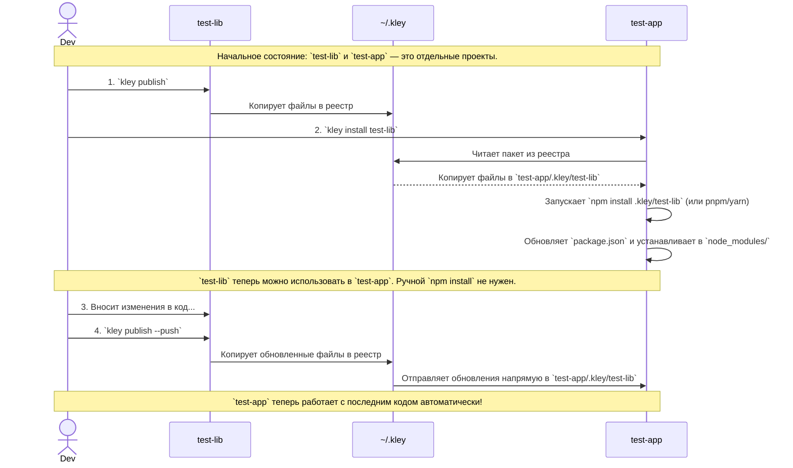
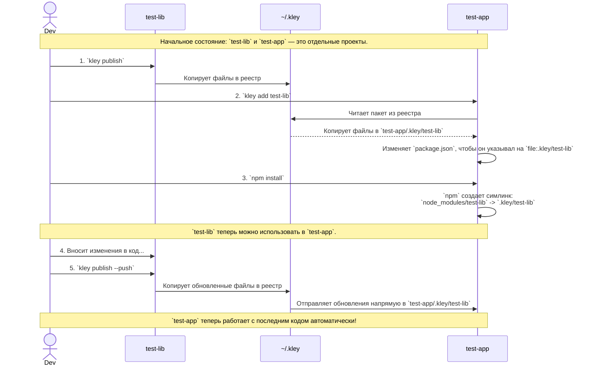
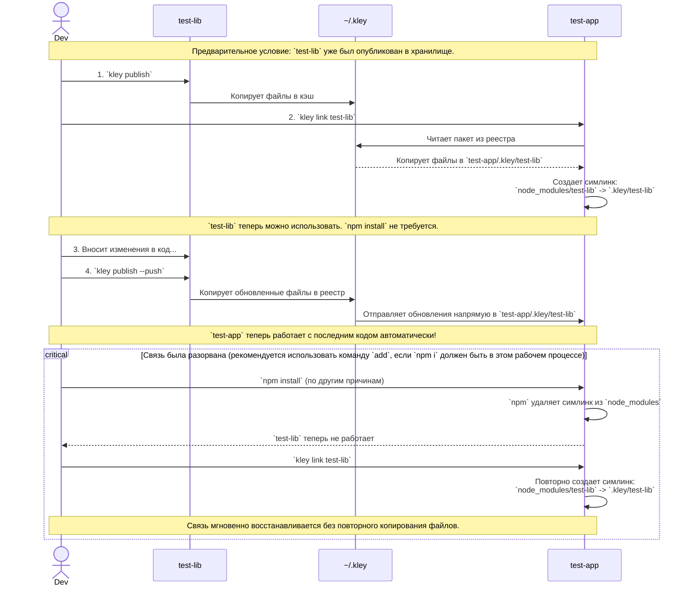

# 📦 kley

[](https://github.com/sumbad/kley/releases)
[](#installation)
[](https://www.npmjs.com/package/kley-cli)
[](https://crates.io/crates/kley)
[](./LICENSE)

[English](./README.md) | Русский

**Простой локальный менеджер пакетов для npm (JS/TS)**

> Как **`npm link`**, но с более удобным рабочим процессом. Как **`yalc`**, но без зависимости от Node.js.

**kley** — это утилита командной строки, которая упрощает локальную разработку npm-пакетов. Она предоставляет надежную альтернативу `npm link`, управляя локальным хранилищем пакетов. Сохраняет пакеты в центральный кэш на вашем компьютере при "публикации" и позволяет быстро устанавливать их в локальные проекты через прямое копирование или симлинки, без необходимости подключения к удаленному репозиторию.

## Ключевые особенности

- **Быстрый и эффективный**: Вся работа выполняется локально, без задержек в сети и избыточной публикации промежуточных версий.
- **Надежный и независимый**: Позволяет избежать проблем с `npm link` и работает, даже если ваша библиотека и проекты используют разные версии Node.js.
- **Безопасный по дизайну**: Работает с файлами напрямую, минимизируя выполнение скриптов пакетов.
- **Простой API**: Две основных команды: `publish` и `install` для начала работы.
- **Кроссплатформенный**: Работает на macOS, Linux и Windows.

## Начало работы

Если задача в простом использование локально собранного пакета, то достаточно двух команд `publish` и `install`. Разберём их применение на базовом сценарии:

**Шаги:**
1. В директории вашей **библиотеки** — запустите `kley publish`: копирует файлы пакета в реестр `kley`.
2. В директории вашего **проекта** — запустите `kley install <имя библиотеки>`: копирует файлы в `.kley/`, обновляет `kley.lock` и автоматически запускает нативный пакетный менеджер для установки пакета в `node_modules/`.
3. Внесите изменения в вашу библиотеку, затем запустите `kley publish --push`: обновляет все связанные проекты.


<details>
<summary>Схема с деталями</summary>

На диаграмме ниже показаны ключевые шаги: публикация, добавление зависимости, а затем отправка обновления.


</details>


<details>
<summary>Если нужно больше контроля, то ниже два рабочих процесса, иллюстрирующих, как ещё можно использовать `kley`</summary>


### Сценарий 1: Надежный рабочий процесс `publish->add->npm i`

Это наиболее распространенный и надежный рабочий процесс. Он идеально подходит, когда вы действуете в рамках привычного флоу `npm install`, но при этом хотите двигаться быстрее без публикаций в удалённый репозиторий.

**Шаги:**
1. В директории вашей **библиотеки** — запустите `kley publish`: копирует файлы пакета в реестр `kley`.
2. В директории вашего **проекта** — запустите `kley add <имя библиотеки>`: копирует файлы в `.kley/` и обновляет `package.json`.
3. Запустите `npm install`, npm создает `node_modules/<имя библиотеки>` из `.kley/<имя библиотеки>`.
4. Внесите изменения в вашу библиотеку, затем запустите `kley publish --push`: обновляет все связанные проекты. Или просто `kley publish`, но в этом случае нужно дополнительно выполнить `kley update` в директории проекта, чтобы скачать изменённую версию.
5. Запустите `npm install`. Можно использовать **проект** с обновлённой **библиотекой**.


<details>
<summary>Схема с деталями</summary>

На диаграмме ниже показаны ключевые шаги: публикация, добавление зависимости, а затем отправка обновления.


</details>

### Сценарий 2: Быстрая итерация с `publish->link`

Этот рабочий процесс идеально подходит для быстрого, временного тестирования, когда вы не хотите изменять `package.json`. Он быстрее, потому что пропускает шаг `npm install`, но менее надежен.

**Шаги:**
1. В директории вашей **библиотеки** — запустите `kley publish`: копирует файлы пакета в реестр `kley`.
2. В директории вашего **проекта** — запустите `kley link <имя библиотеки>`: копирует файлы в `.kley/` и создает симлинк напрямую в `node_modules/<имя библиотеки>` — **`npm install` не требуется**
3. Внесите изменения в вашу библиотеку, затем запустите `kley publish --push`: автоматически обновляет проект.

> ⚠️ **Примечание:**: Если вы запустите `npm install` по какой-либо причине, то он удалит симлинк. Восстановить его можно снова запустив `kley link <имя>`.


<details>
<summary>Схема с деталями</summary>

Эта диаграмма показывает, как `kley link` обеспечивает прямое соединение и как его можно "разорвать" и "восстановить".



</details>

### **Быстрый выбор:** Не уверены, какой рабочий процесс использовать?

| | Сценарий 1 `publish→add→npm i` | Сценарий 2 `publish→link` |
|---|---|---|
| Лучше всего для | Стабильной, текущей разработки | Быстрого, временного тестирования |
| Изменяет `package.json` | Да | Нет |
| Требует `npm install` | Да | Нет |
| Выдерживает `npm install` | Да | Нет. Запустите `kley link` снова |

</details>


## Установка

### Быстрая установка (рекомендуется)

Вы можете установить `kley` одной командой с помощью установочного скрипта:

```bash
# Linux / macOS
curl --proto '=https' --tlsv1.2 -LsSf https://github.com/sumbad/kley/releases/latest/download/kley-installer.sh | sh
```
```bash
# Windows
powershell -ExecutionPolicy Bypass -c "[Net.ServicePointManager]::SecurityProtocol = [Net.SecurityProtocolType]::Tls12; irm https://github.com/sumbad/kley/releases/latest/download/kley-installer.ps1 | iex"
```

### Ручная установка

В качестве альтернативы, вы можете установить `kley`, скачав готовый бинарный файл со страницы [**Релизов**](https://github.com/sumbad/kley/releases).

1.  Скачайте архив, подходящий для вашей системы (например, `kley-x86_64-apple-darwin.tar.gz`).
2.  Распакуйте архив.
3.  Переместите бинарный файл `kley` в директорию, которая находится в `PATH` вашей системы (например, `/usr/local/bin` для macOS/Linux).

### Установка через npm (kley-cli)
⚠️ **Примечание:** Пакет npm оборачивает бинарный файл `kley` и требует Node.js для запуска.
Если ваша библиотека и использующий ее проект на **разных версиях Node.js**, лучше используйте [установщик бинарного файла](#быстрая-установка-рекомендуется) или установку через Cargo.

```bash
npm install -g kley-cli
```

### Установка через Cargo (crates.io)
Если у вас установлен Rust и Cargo, вы можете установить `kley` напрямую с crates.io:

```bash
cargo install kley
```

## Использование

### 1. `kley publish`
Выполните эту команду в директории пакета, который вы хотите опубликовать локально. Kley копирует все необходимые файлы в центральное хранилище по пути `~/.kley/packages/<имя-вашего-пакета>`.

- Используйте флаг `--push`, чтобы автоматически обновить пакет во всех проектах, куда он был добавлен или прилинкован. Это основная команда для быстрого, итеративного рабочего процесса.

### 2. `kley unpublish`
Выполните эту команду в директории опубликованного пакета, чтобы удалить его из хранилища kley.

- По умолчанию выполняется "мягкое" удаление: пакет удаляется из хранилища, но ваши проекты остаются нетронутыми до следующей установки.
- Используйте флаг `--push` для "жесткого" удаления, которое также удаляет пакет из всех проектов, где он используется.

### 3. `kley install <имя-пакета>` (алиас `i`)
Универсальная команда, объединяющая `add` и установку через нативный пакетный менеджер. Она автоматически определяет, использует ли ваш проект `npm`, `pnpm` или `yarn`, копирует пакет в `.kley/`, обновляет `kley.lock` и делегирует установку соответствующему пакетному менеджеру — всё за один запуск.

- Поддерживает `npm`, `pnpm` и `yarn` из коробки.
- Для более явного указания используемого пакетного менеджера можно установить `packageManager` значение в файле `package.json` или `kley.lock`.
- **Lifecycle-скрипты** (`preinstall`, `install`, `postinstall`) **отключены по умолчанию** (`--ignore-scripts`) в целях безопасности. Это предотвращает выполнение произвольного кода при установке. Если для работы пакета требуются lifecycle-скрипты (например, нативные модули), запустите пакетный менеджер вручную.

> **Примечание:** Если нужно добавить пакет как dev-зависимость (`--dev`), используйте `kley add --dev` и запустите пакетный менеджер вручную.

### 4. `kley add <имя-пакета>`
Выполните эту команду в проекте, где вы хотите использовать ваш локальный пакет. Kley скопирует пакет в локальную директорию `./.kley/`, а затем автоматически обновит ваши `package.json` и `kley.lock`.

- Используйте флаг `--dev`, чтобы добавить пакет в `devDependencies`.

> **Примечание:** Чтобы изменения появились в `node_modules`, вы должны запустить `npm install` (или `yarn`, `pnpm`) после `kley add`. Для однотипной альтернативы используйте `kley install`.

### 5. `kley link <имя-пакета>`
Эта команда предоставляет гибкий рабочий процесс, который позволяет избежать изменения `package.json`. Она копирует пакет в локальный кэш `.kley`, а затем создает символическую ссылку из этого кэша в директорию `node_modules` вашего проекта.

> **Внимание:** Поскольку `package.json` не изменяется, запуск `npm install` (или `yarn`, `pnpm`) скорее всего удалит симлинк из `node_modules`. Чтобы восстановить его, просто снова выполните `kley link <имя-пакета>`. Это быстрая операция, так как локальный кэш сохраняется.

### 6. `kley update [имя-пакета]`
Эта команда обновляет установленные пакеты до последней версии из хранилища kley.

- Если вы укажете имя пакета, будет обновлен только этот конкретный пакет.
- Если вы запустите команду без аргументов, `kley` обновит все пакеты, перечисленные в `kley.lock`.

### 7. `kley remove [имя-пакета]`
Выполните эту команду, чтобы чисто удалить управляемую kley зависимость из вашего проекта. Она обновит `package.json` и `kley.lock`, а также удалит файлы пакета из директории `./.kley/`.

- Используйте флаг `--all`, чтобы удалить все управляемые kley пакеты из проекта.

## Переменные окружения

| Переменная | По умолчанию | Описание |
|---|---|---|
| `KLEY_HOME` | `~` (домашняя директория) | Директория, где kley хранит свой реестр (`$KLEY_HOME/.kley/`). По умолчанию kley использует домашнюю директорию вашей системы. Переопределите эту переменную, чтобы хранить реестр в другом месте (например, для CI/CD или изолированных тестовых окружений). |
| `KLEY_USE_NPM_COMMAND` | `npm` | Переопределяет путь к исполняемому файлу `npm`. Полезно для тестирования или когда npm не в `PATH`. |
| `KLEY_USE_PNPM_COMMAND` | `pnpm` | Переопределяет путь к исполняемому файлу `pnpm`. |
| `KLEY_USE_YARN_COMMAND` | `yarn` | Переопределяет путь к исполняемому файлу `yarn`. |

## О проекте

Этот проект вдохновлен таким замечательным инструментом, как [yalc](https://github.com/wclr/yalc). Главное преимущество `kley` в том, что это единый, самодостаточный бинарный файл, **не имеющий зависимости от Node.js**. Это означает, что вы можете управлять пакетами независимо от вашей текущей версии Node.js или каких-либо проблем с самим `npm`.

## Лицензия

Проект лицензирован под лицензией MIT - подробности см. в файле LICENSE.
