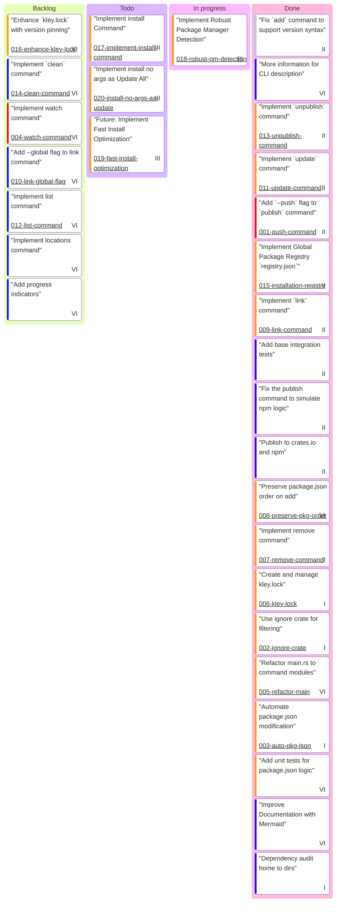

# Project Board

This board tracks the progress of development tasks for the kley project.

**Epics:**
- **I:** Core Publishing & Adding
- **II:** Publish Automation & Linking Speed
- **III:** Streamlined Local Package Workflow
- **IV:** Yarn/Pnpm Workspaces Support
- **V:** Monorepos & Sub-projects
- **VI:** DX/UX Improvements (General)

**Complexity Estimate (color):**
- `Very High`: Complex task, may require significant refactoring or research.
- `High`: A feature with multiple components.
- `Low`: A small, well-defined task.
- `Very Low`: A trivial change.

**NOTE:**
- When setting the `priority` field in the Mermaid Kanban diagram, use only the following allowed values: `'Very High'`, `'High'`, `'Low'`, `'Very Low'`.
- Kanban task titles should not contain special characters like ()@".
- Use only alphanumeric characters, spaces, and hyphens.
---

