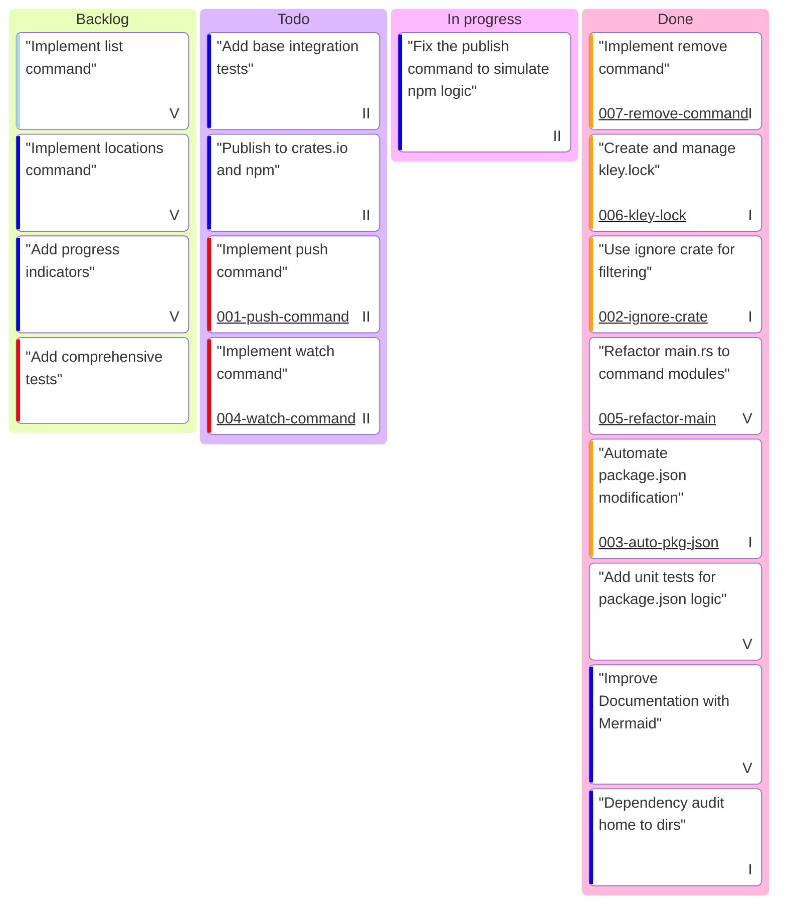

# Project Board

This board tracks the progress of development tasks for the kley project.

**Epics:**
- **I:** Core Publishing & Adding
- **II:** Publish Automation & Linking Speed
- **III:** Yarn/Pnpm Workspaces Support
- **IV:** Monorepos & Sub-projects
- **V:** DX/UX Improvements

**Complexity Estimate (color):**
- `Very High`: Complex task, may require significant refactoring or research.
- `High`: A feature with multiple components.
- `Low`: A small, well-defined task.
- `Very Low`: A trivial change.

---

