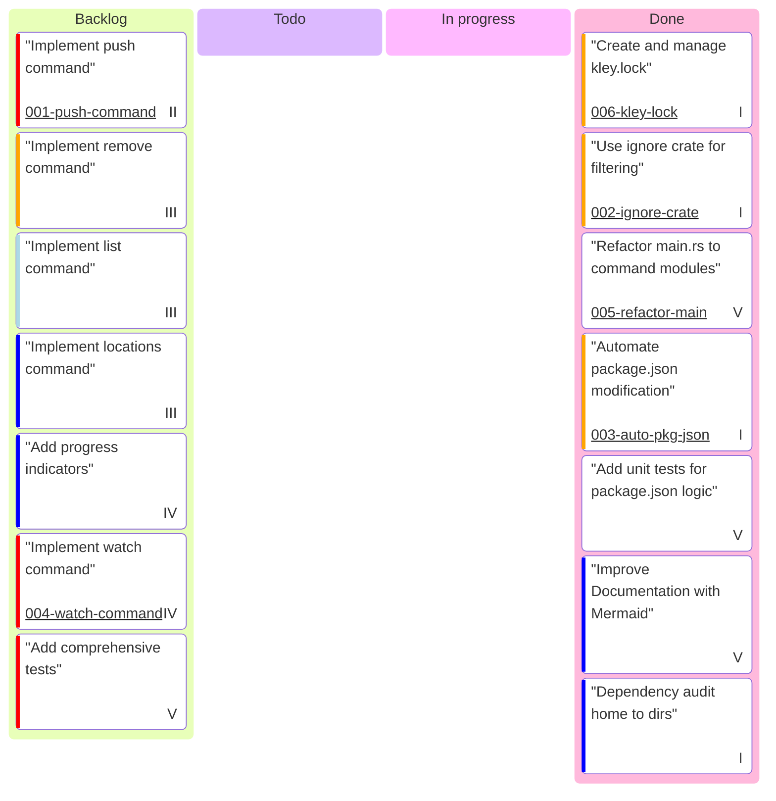

# Project Board

This board tracks the progress of development tasks for the kley project.

**Epics:**
- **I:** Core Publishing & Linking
- **II:** Update Propagation
- **III:** Project Management
- **IV:** DX/UX Improvements
- **V:** Code Quality & Testing

**Complexity Estimate (color):**
- `Very High`: Complex task, may require significant refactoring or research.
- `High`: A feature with multiple components.
- `Low`: A small, well-defined task.
- `Very Low`: A trivial change.

---

