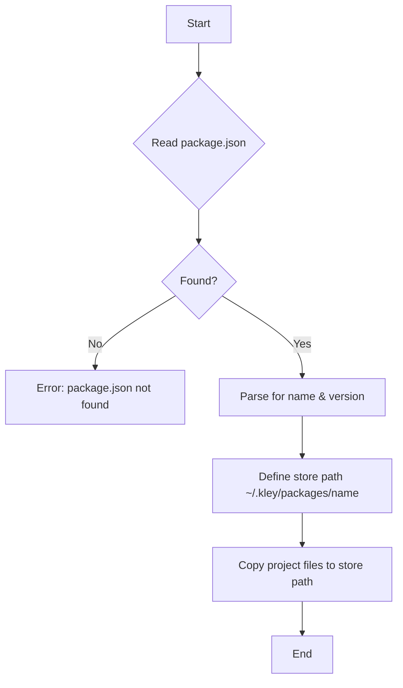
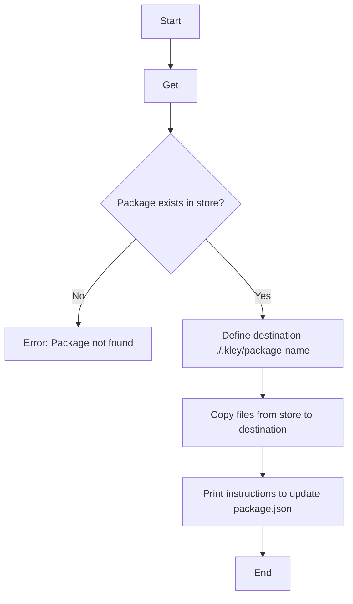

# kley Project Specification

## 1. Project Title
kley - A Fast and Reliable Local Package Manager for npm (JS/TS)

## 2. Description
kley is a command-line interface (CLI) tool written in Rust designed to streamline local development and testing of npm packages. It provides a robust and performant alternative to traditional methods like `npm link` or existing tools like `yalc`, by managing a local package store and facilitating easy integration into host projects.

## 3. Motivation
Developing and testing local npm packages, especially within monorepositories or when building libraries, often presents challenges with symbolic links (`npm link`, `yarn link`). These challenges include:
- Inconsistent dependency resolution.
- Issues with bundlers and build tools that struggle with symlinks.
- Complex setups for hot-reloading or watching changes.
- Slower performance compared to direct file copying.

Kley aims to address these issues by offering a mechanism to "publish" packages to a central local store and then "add" them to host projects via direct file copying, thereby avoiding symlink-related problems and potentially offering better performance due to its Rust implementation.

## 4. Key Features

### 4.1. `kley publish`
- **Purpose**: To compile and store a local npm package in Kley's central package repository on the user's machine.
- **Functionality**:
    - Reads the `package.json` file in the current working directory to identify the package's name and version.
    - Copies the entire package directory (excluding specified ignored files/directories like `node_modules`, `.git`, `target`, `.kley`) into `~/.kley/packages/<package-name>`.
    - Overwrites existing packages in the store with the same name.
    - Provides clear console feedback on the publication status.

### 4.2. `kley add <package-name>`
- **Purpose**: To integrate a locally "published" package into a host project.
- **Functionality**:
    - Locates the specified package in the local Kley store (`~/.kley/packages/<package-name>`).
    - Copies the contents of the stored package into a dedicated directory within the host project (e.g., `.kley/<package-name>`).
    - Instructs the user on how to manually update their host project's `package.json` to reference the newly added package using a `file:` dependency (e.g., `"my-local-lib": "file:.kley/my-local-lib"`).
    - Provides clear console feedback on the addition status.

### 4.3. Workflow Diagrams

#### `kley publish`

#### `kley add`

## 5. Technical Stack
- **Language**: Rust
- **CLI Argument Parsing**: `clap` crate
- **Error Handling**: `anyhow` crate
- **File System Operations**: Standard Rust `std::fs` and `fs_extra` crate
- **JSON Serialization/Deserialization**: `serde` and `serde_json` crates
- **Terminal Output Styling**: `colored` crate
- **Home Directory Resolution**: `home` crate

## 6. Future Considerations / Roadmap (High-level)
- Integration of the `ignore` crate for more robust and configurable file exclusion during `publish`.
- Potential for automatic `package.json` modification during the `add` command.
- Implementation of an `uninstall` command to remove locally added packages.
- Implementation of a `list` command to display all packages currently in the Kley store.
- Comprehensive unit and integration testing.
- Cross-platform compatibility improvements.
