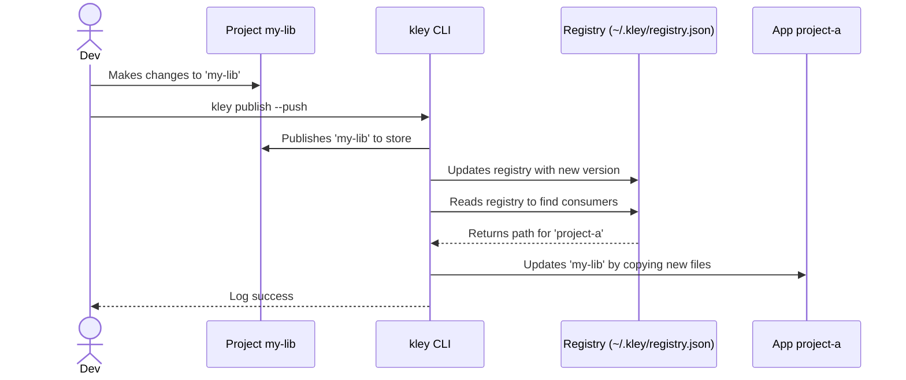

# kley Project Specification

## 1. Project Title
kley - A Fast and Reliable Local Package Manager for npm (JS/TS)

## 2. Description
kley is a command-line interface (CLI) tool written in Rust designed to streamline local development and testing of npm packages. It provides a robust and performant alternative to traditional methods like `npm link` or existing tools like `yalc`, by managing a local package store and facilitating easy integration into host projects.

## 3. Motivation
Developing and testing local npm packages, especially within monorepositories or when building libraries, often presents challenges with symbolic links (`npm link`, `yarn link`). These challenges include:
- Inconsistent dependency resolution.
- Issues with bundlers and build tools that struggle with symlinks.
- Complex setups for hot-reloading or watching changes.
- Slower performance compared to direct file copying.

Kley aims to address these issues by offering a mechanism to "publish" packages to a central local store and then "add" or "link" them to host projects, avoiding symlink-related problems and offering superior performance due to its Rust implementation.

## 4. Key Features

### 4.1. Core Workflow Commands

**`kley publish [--push]`**
- **Purpose**: To publish a package to the central `kley` store and optionally "push" it to all consumer projects.
- **Functionality**:
    - Reads `package.json` and respects `.npmignore`/`.kleyignore` files for accurate packaging.
    - Copies package contents to `~/.kley/packages/<package-name>`.
    - Updates the global `~/.kley/registry.json` with the package's new version and metadata.
    - If `--push` is used, it automatically triggers an `update` in every project that uses this package.

**`kley add <package-name>`**
- **Purpose**: To add a `kley`-managed package to a project.
- **Functionality**:
    - Copies the package from the store into the project's `./.kley/` directory.
    - Automatically modifies the project's `package.json` to add a `file:` dependency.
    - Creates/updates a local `kley.lock` file.
    - Registers the installation in the global `registry.json`.

**`kley link <package-name>`**
- **Purpose**: A flexible workflow for local development that avoids modifying `package.json`.
- **Functionality**: Copies package files to a local `./.kley` cache, then symlinks `node_modules` to that cache. This installation **is tracked** in the global registry, allowing `publish --push` to work. The symlink **will be overwritten** by `npm install`, but can be quickly restored by running `kley link` again.

**`kley remove <package-name>`**
- **Purpose**: To cleanly remove a `kley`-managed package from a project.
- **Functionality**: Reverses the `add` operation by removing the dependency from `package.json`, `kley.lock`, the `./.kley` directory, and de-registering it from the global `registry.json`.

### 4.2. Automation & Maintenance Commands

**`kley update [package-name]`**
- **Purpose**: To refresh one or all packages in a project to their latest published versions.
- **Functionality**: Re-copies the latest package contents from the store and updates `kley.lock`. Does not modify `package.json`.

**`kley unpublish [--push]`**
- **Purpose**: To remove a package from the `kley` store.
- **Functionality**:
    - Default: Removes the package from the store and the global registry.
    - With `--push`: Also executes the `remove` logic in every consumer project for a full cleanup.

**`kley list [package-name]`**
- **Purpose**: To view the contents of the `kley` store and see where packages are used.
- **Functionality**: Reads `registry.json` to display a list of all published packages, their versions, and where they are installed.

**`kley clean`**
- **Purpose**: A maintenance command to clean up stale registry entries.
- **Functionality**: Checks all installation paths in `registry.json` and removes any that no longer exist on the filesystem.

## 5. Workflow Diagram: The "Push" Flow

## 6. Technical Stack
- **Language**: Rust
- **CLI Argument Parsing**: `clap`
- **File System Operations**: `std::fs`, `fs_extra`
- **File Content Filtering**: `ignore`
- **JSON Handling**: `serde`, `serde_json`
- **Error Handling**: `anyhow`
- **Terminal Output Styling**: `colored`
- **Home Directory Resolution**: `dirs`

## 7. Future Considerations / Roadmap
With the core workflow now fully designed, future development will focus on:
- **`watch` command**: A long-running process to automatically run `publish --push` when files change.
- **Monorepo Support (Yarn/Pnpm Workspaces)**: Deeper integration with monorepo tooling.
- **Performance**: Further optimizations, including parallel updates.
- **User Experience**: Progress indicators, better error reporting, and interactive commands.
- **Cross-platform compatibility improvements.**

