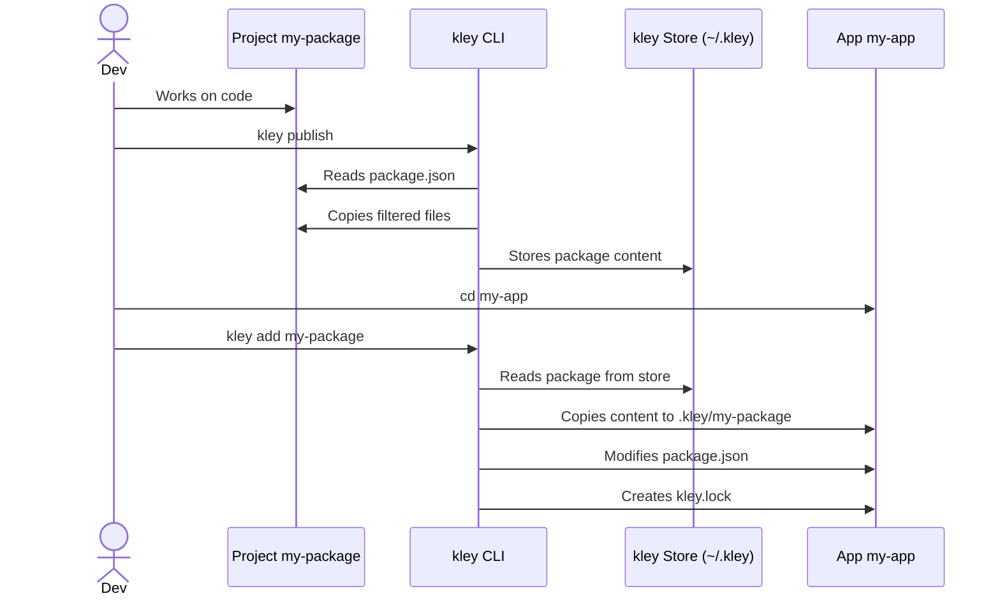

# Epic I: Core Publishing & Adding

*The absolute basics of getting a package from source to a host project, providing a solid foundation for the `kley` workflow.*

## 1. Goal
After completing this epic, a user will be able to:
1.  **Publish** a local npm package to the kley store.
2.  **Add** that package to a host project, with the host's `package.json` being **automatically modified** to include the correct `file:` dependency.
3.  **Remove** that package from a host project, cleaning up all related artifacts (`package.json`, `kley.lock`, `.kley` directory).

This will provide a complete, functional, and superior alternative to the `npm link` workflow.

## 2. Scope of Work
To achieve this goal, the following high-level tasks are required:

- **Enhance `publish` command**:
    - Integrate the `ignore` crate to respect `.npmignore` and `.kleyignore` files, ensuring only necessary files are published to the store.
- **Enhance `add` command**:
    - Read the host project's `package.json`.
    - Parse the JSON, add/update the `dependencies` or `devDependencies` section with the new `file:` reference.
    - Write the modified `package.json` back to disk, preserving formatting as much as possible.
- **Create `kley.lock` file**:
    - Upon adding a package, create a `kley.lock` file in the host project.
    - This file will track which packages were added via kley and their versions.
- **Create `remove` command**:
    - Implement the logic to reverse the `add` operation, cleaning up the project.

## 3. Diagrams

### Use Case: Basic Workflow

## 4. Notes & Nuances
- **`package.json` Modification**: Modifying a JSON file while preserving user formatting (indentation, key order) is non-trivial. We must use a JSON library that supports this to provide a good user experience.
- **`kley.lock` Structure**: The initial structure of `kley.lock` needs to be defined. A simple key-value store is likely sufficient for this epic.

## 5. Links
- **Primary Reference**: [yalc Usage Documentation](https://github.com/wclr/yalc?tab=readme-ov-file#usage)
- **File Filtering**: [ignore crate](https://crates.io/crates/ignore)
- **JSON Handling**: [serde_json crate](https://crates.io/crates/serde_json)
