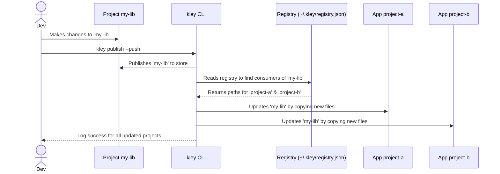

# Epic II: Publish Automation & Linking Speed

*The goal of this epic is to dramatically accelerate and simplify the iterative development loop. While Epic I provided the basic tools to replace `npm link`, Epic II builds powerful automation on top of that foundation, allowing changes to be synced between a library and its consumers almost instantly.*

## 1. Goal
After completing this epic, a developer will be able to:
1.  **Automatically "push"** updates from a developing package to all projects that use it, using a single `publish --push` command.
2.  **Manually update** a package in the current project to the latest published version (`update`).
3.  **Completely remove** a package not only from the store but from all consumer projects (`unpublish --push`).
4.  **See where** and what versions of packages are being used (`list`).

The key enabler for all this functionality is the creation of a **Global Package Registry (`registry.json`)**.

## 2. Scope of Work
- **Implement Global Package Registry (`registry.json`)**:
    - Create a centralized `~/.kley/registry.json` file to store metadata (version, lastUpdated) and the list of installations for each package.
    - Modify the `add`, `link`, and `remove` commands to correctly update this registry.
- **Enhance `publish` command with `--push` flag**:
    - Add a `--push` flag to the `publish` command. When present, it first performs the publish action, then automatically triggers the `update` logic in all consumer projects listed in the registry.
- **Implement `update` command**:
    - Implement a manual "update" command that syncs package(s) in the current project with the version from the store.
- **Enhance `unpublish` command**:
    - Add a `--push` flag for cascading the deletion of a package to all its consumer projects.
- **Implement `list` command**:
    - Create a command for conveniently viewing the store's contents and installation information from `registry.json`.

## 3. Diagrams

### Use Case: The "Push" Workflow

This diagram illustrates the main scenario for this epic.

## 4. Notes & Nuances
- **Central Role of the Registry**: `registry.json` is the "brain" of this entire epic. Its reliable implementation is critical.
- **Logic Reusability**: The core logic for `update` and `remove` should be factored into reusable functions so they can be called by `publish --push` and `unpublish --push`.

