# M1: Minimum Viable Product

## Goal
Provide a complete minimum-viable cycle for working with local npm packages:
publish → add/install → update → remove — without tying the user to a specific package manager.

## Outcome
After completion, the user can publish a package to the local store, install it
into a project (as a dependency or dev-dependency), update all packages with a
single command, and cleanly remove them. The tool is ready for everyday use in
the basic workflow.

### Progress: 30/30

```mermaid
---
config:
  kanban:
    ticketBaseUrl: 'https://github.com/sumbad/kley/tree/master/docs/tickets/#TICKET#.md'
    
    ### Legend
    # assigned - 🧩 = feat | 🐞 = bug
    # priority - `Very High` = Critical | `High` = High | `Low` = Medium | `Very Low` = Low
    # ticket - used for a ticket file name (tickets/#TICKET#.md)
---
%%{init: {
  'theme': 'base',
  'themeVariables': {
    'darkMode': false,
    'background': '#F0F2EB'
  }
}}%%

kanban
    Todo

    In Progress

    Done
        "Rework link: direct symlink to source"<br/><br/>@{ assigned: 🧩, priority: 'Very High', ticket: 'f-32' }
        "Skip PM for dependency-less packages"<br/><br/>@{ assigned: 🧩, priority: 'Low', ticket: 'f-26' }
        "Add --no-save flag to install command"<br/><br/>@{ assigned: 🧩, priority: 'Low', ticket: 'f-33' }
        "Fast Reinstall - skip PM when deps unchanged"<br/><br/>@{ assigned: 🧩, priority: 'Low', ticket: 'f-27' }
        "Add --dev flag to install command"<br/><br/>@{ assigned: 🧩, priority: 'Low', ticket: 'f-20' }
        "Install no args as Update All"<br/><br/>@{ assigned: 🧩, priority: 'High', ticket: 'f-19' }
        "I. Dependency audit home to dirs"<br/><br/>@{ assigned: 🧩, priority: 'Low' }
        "I. Use ignore crate for filtering"<br/><br/>@{ assigned: 🧩, priority: 'High', ticket: 'f-2' }
        "I. Automate package.json modification"<br/><br/>@{ assigned: 🧩, priority: 'High', ticket: 'f-3' }
        "I. Create and manage kley.lock"<br/><br/>@{ assigned: 🧩, priority: 'High', ticket: 'f-6' }
        "I. Implement remove command"<br/><br/>@{ assigned: 🧩, priority: 'High', ticket: 'f-7' }
        "II. Add --push flag to publish command"<br/><br/>@{ assigned: 🧩, priority: 'Very High', ticket: 'f-1' }
        "II. Implement link command"<br/><br/>@{ assigned: 🧩, priority: 'High', ticket: 'f-8' }
        "II. Implement update command"<br/><br/>@{ assigned: 🧩, priority: 'High', ticket: 'f-10' }
        "II. Implement unpublish command"<br/><br/>@{ assigned: 🧩, priority: 'High', ticket: 'f-12' }
        "II. Implement Global Package Registry"<br/><br/>@{ assigned: 🧩, priority: 'High', ticket: 'f-14' }
        "II. Fix add command to support version syntax"<br/><br/>@{ assigned: 🧩, priority: 'Very Low' }
        "II. Fix the publish command to simulate npm logic"<br/><br/>@{ assigned: 🐞, priority: 'Low' }
        "II. Publish to crates.io and npm"<br/><br/>@{ assigned: 🧩, priority: 'Low' }
        "II. Add base integration tests"<br/><br/>@{ assigned: 🧩, priority: 'Low' }
        "II. Publish --push deletes package dependencies"<br/><br/>@{ assigned: 🧩, priority: 'High', ticket: 'f-28' }
        "Implement install Command"<br/><br/>@{ assigned: 🧩, priority: 'High', ticket: 'f-16' }
        "Implement Robust PM Detection"<br/><br/>@{ assigned: 🧩, priority: 'High', ticket: 'f-17' }
        "Strip devDependencies from consumed packages"<br/><br/>@{ assigned: 🧩, priority: 'Low', ticket: 'f-18' }
        "Refactor main.rs to command modules"<br/><br/>@{ assigned: 🧩, priority: 'High', ticket: 'f-5' }
        "Preserve package.json order on add"<br/><br/>@{ assigned: 🐞, priority: 'High', ticket: 'b-1' }
        "Fix normalized_path UNC path on Windows"<br/><br/>@{ assigned: 🐞, priority: 'Low', ticket: 'b-2' }
        "Add unit tests for package.json logic"<br/><br/>@{ assigned: 🧩, priority: 'High' }
        "Improve Documentation with Mermaid"<br/><br/>@{ assigned: 🧩, priority: 'Low' }
        "More information for CLI description"<br/><br/>@{ assigned: 🧩, priority: 'Low' }

```

<progress value="30" max="30"></progress>

