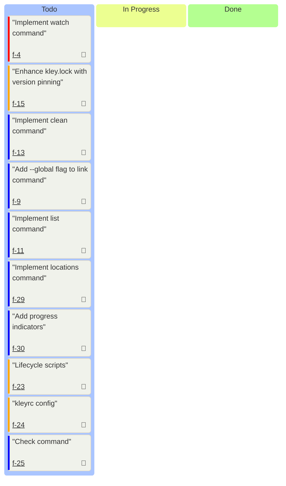

# M2: Extended Functionality

## Goal
Extend the tool for advanced scenarios: workspaces support, alternative package
managers, watch mode, configuration, lifecycle scripts, and diagnostic commands.

## Outcome
After completion, the user can work with monorepo structures (Yarn/Pnpm
workspaces), automatically track changes (watch), configure behavior via
.kleyrc, use lifecycle scripts, and run diagnostic commands (check, list,
clean).

### Progress: 0/10
<progress value="0" max="10"></progress>

