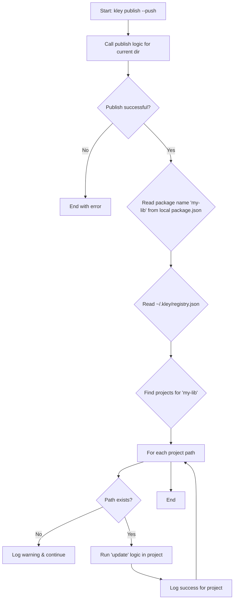

# Ticket 001: Add `--push` flag to `publish` command

- **Epic**: II (Publish Automation & Linking Speed)
- **Complexity**: Very High

## 1. Description
To create a fast and efficient iterative development loop, the `publish` command will be enhanced with a `--push` flag. When this flag is used, `kley` will not only publish the package to the store but will also immediately "push" the new version to all projects where it is currently installed.

This replaces the concept of a separate `push` command with a more consistent and composable CLI grammar, aligning with the `unpublish --push` command.

## 2. Core Prerequisite
- This feature is critically dependent on the **Global Package Registry** (`T015`) being implemented, as it needs the registry to know where to push the updates.

## 3. Acceptance Criteria
1.  An optional `--push` flag is added to the `kley publish` command.
2.  If the flag is **not** present, `kley publish` behaves as it normally does (publishes only to the store).
3.  If the flag **is** present (`kley publish --push`):
    a. The command first performs the standard `publish` operation.
    b. After a successful publish, it reads the `~/.kley/registry.json` file to find all project paths associated with the package.
    c. For each registered project path, it performs the logic of the `kley update` command (re-copies the package files and updates the local `kley.lock`).
    d. It provides clear console output, listing each project that was successfully updated.
    e. It should report warnings for any project paths that are no longer valid.

## 4. Implementation Plan
1.  **Modify `publish` command**:
    - Add the optional `--push: bool` flag to the `Publish` command struct in `src/main.rs`.
    - In the `publish` command handler (`src/commands/publish.rs`), check if the `push` flag is active.
2.  **Refactor `update` logic**:
    - Ensure the core logic of the `update` command is in a reusable function (e.g., `update::run_update(package_name, project_path)`).
3.  **Implement Push Logic**:
    - If `--push` is active, after the core `publish` logic completes:
        a. Read the package name from the local `package.json`.
        b. Get the list of installation paths from the `registry.json`.
        c. Loop through the paths and call the reusable `update::run_update()` function for each one.
4.  **Add Tests**: Create integration tests to verify the behavior of `publish --push`.

## 5. Workflow Diagram

