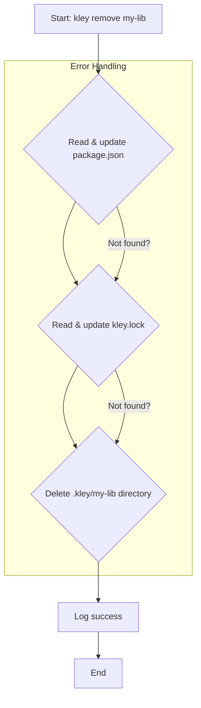
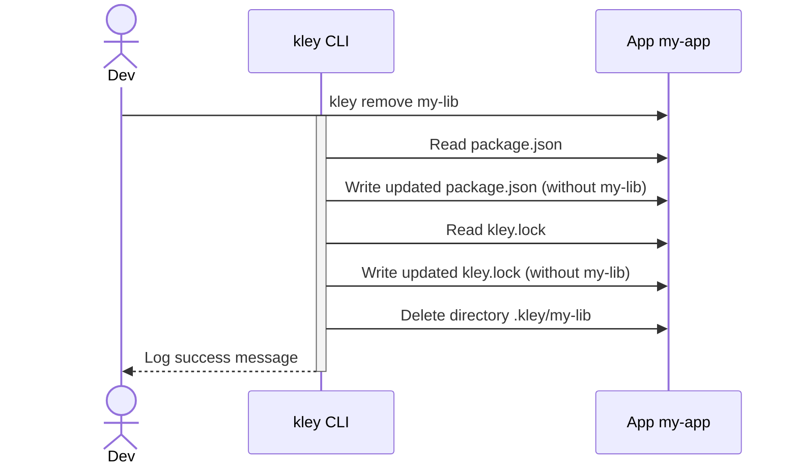

# Ticket 007: Implement `remove` command

- **Epic**: I (Core Publishing & Linking)
- **Complexity**: High

## 1. Description
The `remove` command completes the lifecycle of a local dependency by providing a clean, automated way to uninstall a package from a project. It reverses the actions performed by `kley add`, ensuring the project state is clean and ready for production without manual cleanup.

## 2. Acceptance Criteria
1.  A new command `kley remove <package-name>` is implemented.
2.  The command removes the dependency from `package.json`, searching across `dependencies`, `devDependencies`, and `peerDependencies`.
3.  The command removes the package entry from `kley.lock`.
4.  The command deletes the package directory from the project's `.kley/` folder.
5.  The command provides clear console output confirming the removal.
6.  An optional flag, `kley remove --all`, removes all kley-managed packages listed in `kley.lock`.
7.  The command is idempotent: running it a second time does not result in an error, but instead shows a message like "Package 'my-lib' is not installed."

## 3. Technical Details
- The `remove` command will have its own module: `src/commands/remove.rs`.
- **`package.json` Logic**:
    - The function should parse `package.json` into a `serde_json::Value`.
    - It must iterate through `dependencies`, `devDependencies`, and `peerDependencies` to find and remove the package entry.
    - The modified `serde_json::Value` should be written back, preserving the original file's indentation.
- **`kley.lock` Logic**:
    - The function will read and parse `kley.lock`.
    - It will remove the key corresponding to the package name from the `packages` map.
    - The modified `Lockfile` struct will be serialized and written back to disk.
- **Error Handling**: The command should not fail if parts of the installation are already missing. For example, if the `.kley/<package-name>` directory is gone but entries still exist in `package.json`, the command should clean up the remaining entries gracefully.

## 4. Workflow Diagrams

### Flowchart

### Sequence Diagram

