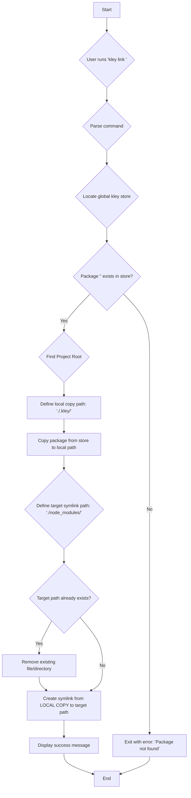

# T009: Implement the 'link' command

## Goal

To add a `kley link <package-name>` command. This command will create a direct symbolic link from the package's location in the global kley store to the current project's `node_modules` directory. This provides a lightweight way to test local packages without modifying the project's `package.json`.

## Expected Result

- A user runs `kley link my-lib`.
- A symlink is successfully created at `./node_modules/my-lib` which points to the corresponding package version in the global kley store.
- A success message is displayed to the user.
- The project's `package.json` and `kley.lock` files are **not** modified.

## Schema of Work

## Implementation Details

1.  **CLI Parsing (`clap`):**
    - Add a `link` subcommand with a required `package_name` argument.
2.  **Path & State Logic:**
    - Reuse existing logic to find the global kley store path.
    - Reuse existing logic to find the consumer project's root.
    - Verify that the package exists in the store before proceeding.
3.  **Copy to Local Project:**
    - Perform a recursive copy of the package directory from the global store (`~/.kley/packages/<pkg>`) to the local project's `.kley` directory (`<project-root>/.kley/<pkg>`). Ensure the `.kley` directory is created if it doesn't exist.
4.  **Filesystem Operations:**
    - Check if a file/directory already exists at the destination (`./node_modules/<package-name>`) and remove it if necessary.
    - Use `std::os::unix::fs::symlink` for Unix-like systems and `std::os::windows::fs::symlink_dir` for Windows to create the link from the **local copy** to `node_modules`.
5.  **User Feedback:**
    - Print a clear success or error message.
