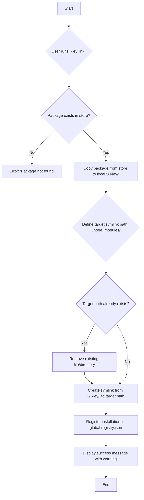

# T009: Implement the 'link' command

## 1. Goal
To add a `kley link <package-name>` command. This command provides a flexible development workflow by linking a package without modifying the project's `package.json`.

This approach is a hybrid: it provides more resilience than a direct global symlink, while keeping the `package.json` clean.

## 2. Core Mechanism
1.  `kley` copies the package content from the global store into the host project's local cache (`./.kley/<package-name>`).
2.  It then creates a symlink from this local cache to `node_modules` (`./node_modules/<package-name> -> ./.kley/<package-name>`).
3.  It **does not** modify `package.json`.
4.  It **does** register the installation in the global `registry.json` with `method: "link"`.

## 3. Important Caveat: `npm install`
- Because `package.json` is not modified, a subsequent `npm install` (or `yarn`, `pnpm`) **will delete the symlink** from `node_modules` if the package is listed as a regular dependency.
- The user must be warned about this. To restore the connection, they can simply run `kley link <package-name>` again, which will be a fast operation as the local cache in `./.kley` still exists.

## 4. Schema of Work

