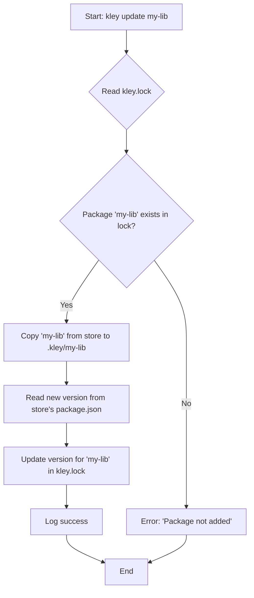

# Ticket 011: Implement `update` command

- **Epic**: II (Publish Automation & Linking Speed)
- **Complexity**: Medium

## 1. Description
The `update` command provides a lightweight way to refresh an already-added or linked local dependency to its latest published version. It avoids the overhead and semantic incorrectness of re-running `kley add`, as it does not modify `package.json`.

This command is the manual counterpart to the automated `push` command, allowing a developer to quickly pull in new changes for a single project.

## 2. Acceptance Criteria
1.  A new command `kley update [package-name]` is implemented.
2.  If `[package-name]` is provided, only that package is updated.
3.  If `[package-name]` is omitted, all packages listed in `kley.lock` are updated.
4.  The command must verify that the package(s) are listed in `kley.lock`. If not, it should fail with a helpful error message (e.g., "Package 'my-lib' is not added. Use 'kley add my-lib' first.").
5.  The command correctly updates packages added with both `kley add` and `kley link`. The update action consists of re-copying files to the project's local `.kley/` directory.
6.  It reads the version from the newly copied package's `package.json` and updates the `version` field in the project's `kley.lock`.
7.  The command **must not** modify the project's `package.json`.
8.  The command provides clear console output confirming which packages were updated.
9.  **Note:** This functionality depends on the `link` command being updated to also create an entry in `kley.lock`.

## 3. Implementation Plan
1.  Add the `Update` command to the `Commands` enum in `src/main.rs`. The `name` argument should be optional.
2.  Create a new command module: `src/commands/update.rs`.
3.  Implement the core logic in `update.rs`:
    - Check if a package name was provided.
    - If yes, build a list containing just that name.
    - If no, read `kley.lock` to get a list of all installed package names.
    - For each package in the list:
        a. Verify it exists in the store.
        b. Use the `utils::copy_from_store()` helper function to copy the files.
        c. Read the version from the package's `package.json` in the store.
        d. Update the `kley.lock` file with the new version.
4.  Wire up the new command in `main.rs` to call the `update` function.
5.  Add integration tests to verify the command's functionality for both single and all-package updates.

## 4. Workflow Diagram

