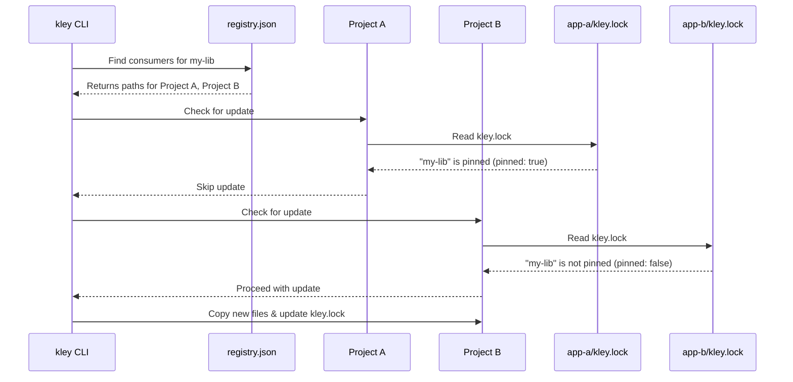

# Ticket 016: Enhance `kley.lock` with Version Pinning

- **Epic**: V (DX/UX Improvements)
- **Complexity**: High

## 1. Description
This task introduces a version pinning mechanism, inspired by `yalc`, to give developers granular control over when local dependencies are updated.

The core idea is that `kley.lock` can "pin" a dependency to a specific version. When `kley publish --push` or `kley update` runs, it will **skip** any packages that are pinned, preventing unwanted automatic updates. This is achieved **without** requiring a complex multi-version store; the global store still only contains the latest published version of each package.

## 2. Desired Behavior
1.  **`kley add <pkg>`**: Adds the latest version. In `kley.lock`, the dependency is marked as **not pinned**.
2.  **`kley add <pkg>@<version>`**: Adds the package (if the version in the store matches) and marks it as **pinned** to `<version>` in `kley.lock`.
3.  **`kley publish --push` / `kley update`**: These commands will check `kley.lock` for each dependency in a project.
    - If `pinned: true`, the dependency is **skipped**.
    - If `pinned: false`, the dependency is updated to the latest version from the store.
4.  **`kley update <pkg>`**: Updates the package to the latest version and sets `pinned: false`.
5.  **`kley update <pkg>@<version>`**: Updates the package to a specific version (if available) and sets `pinned: true`.

## 3. Proposed `kley.lock` Structure
The `PackageInfo` struct within `lockfile.rs` will be enhanced to track the pinned state.

```rust
// In src/lockfile.rs
pub struct PackageInfo {
    pub version: String,
    #[serde(default)] // Defaults to `false` if not present
    pub pinned: bool,
}
```

## 4. Sequence Diagram: Conditional Update
This diagram shows how `publish --push` intelligently decides whether to update a project based on the `kley.lock` file.



## 5. Implementation Plan
1.  Modify the `add` command to parse an optional version string (e.g., `my-lib@1.2.3`).
2.  Update the `PackageInfo` struct in `src/lockfile.rs` to include the `pinned` field.
3.  Update the `add` command's logic to set the `pinned` flag based on whether a version was specified.
4.  Refactor the `update` logic (used by `publish --push` and `update` command) to read `kley.lock`, check the `pinned` flag, and conditionally skip the update.

