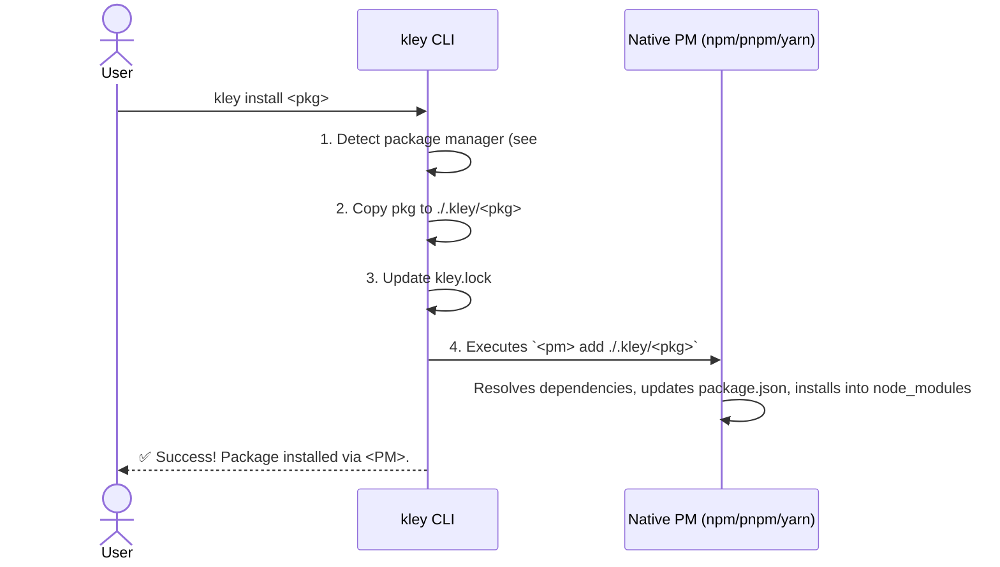

# Ticket 017: Implement `install` Command

- **Epic:** V (DX/UX Improvements)
- **Complexity:** `Medium`
- **Depends On:** #018

## 1. Problem Statement

The current `kley add` workflow is inconvenient as it requires a manual `npm install` step. To provide a user-friendly, one-step experience, a new high-level command is needed.

## 2. Proposed Solution: The `install` Command

A new command, `kley install <package-name>` (alias `i`), will be introduced. It will handle the entire process of adding a local package to a project by delegating the final installation step to the native package manager.

This approach prioritizes simplicity, predictability, and robustness over complex "magic".

### Core Logic

1.  **Detect Package Manager:** The command will first call the robust package manager detection mechanism (detailed in Ticket #018) to identify if `npm`, `pnpm`, or `yarn` is being used.

2.  **Prepare Package:** `kley` copies the specified package from the global `~/.kley` store into the local `./.kley/<package-name>` directory.

3.  **Update Lockfile:** The local `kley.lock` is updated with the package's information.

4.  **Delegate Installation:** `kley` executes the appropriate command for the detected package manager:
    - **npm:** `npm install ./.kley/<package-name>`
    - **pnpm:** `pnpm add ./.kley/<package-name>`
    - **yarn:** `yarn add ./.kley/<package-name>`

This ensures that `package.json` is updated correctly and all transitive dependencies are resolved and installed by the tool that is responsible for them.

### Sequence Diagram

## 3. Acceptance Criteria

- A new command `kley install <pkg>` (and alias `i`) is available.
- The command correctly identifies and uses the project's native package manager.
- After execution, the package is correctly installed and ready for use without any manual steps.
- `package.json` and `kley.lock` are correctly updated.
