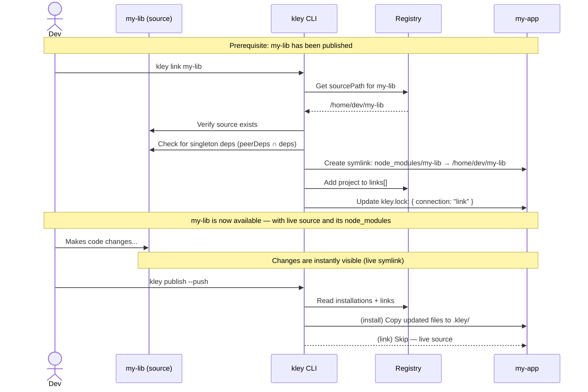

# f-32: Rework `link` Command — Direct Symlink to Package Source

- **Milestone:** M1
- **Complexity:** Medium
- **Depends On:** #001 (publish command), #007 (remove command)

## 1. Problem Statement

The current `kley link` command copies package files from the store to `.kley/<pkg>/` and then creates a symlink from `node_modules/<pkg>` to that copy. Since the store only contains source files (no `node_modules/`), the symlinked package has **no access to its dependencies**.

```
.kley/my-lib/              ← copy from store (no node_modules)
node_modules/my-lib/       ← symlink → .kley/my-lib/
                              ❌ require('lodash') from inside my-lib fails
                                 unless hoisted to project's root node_modules
```

This makes `kley link` unreliable — it works only when the consuming project already has all of the linked package's dependencies hoisted in its own `node_modules/`. With pnpm or Yarn v2+ (strict isolation), it breaks entirely.

By contrast, `npm link` creates a symlink directly to the **live source directory**, where `node_modules/` exists and dependencies are available. The tradeoff is the same as `npm link` (live, unstable source), but at least it works.

## 2. Proposed Solution

Change `kley link` to create a **direct symlink** to the package's source directory instead of to the store copy. Kley will learn the source path from the registry (recorded at `publish` time) and manage the symlink lifecycle.

### Core Changes

#### 2.1. `sourcePath` in Registry

Add a `sourcePath` field to `PackageMetadata`:

```rust
#[derive(Serialize, Deserialize, Debug, Clone)]
#[serde(rename_all = "camelCase")]
pub struct PackageMetadata {
    pub version: String,
    pub last_updated: String,
    pub source_path: Option<PathBuf>,  // ← NEW: path at publish time
    pub installations: Vec<PathBuf>,
    pub links: Vec<PathBuf>,           // ← NEW: linked projects
}
```

`kley publish` records `std::env::current_dir()` into `source_path` on every publish.

#### 2.2. `links` Array in Registry

Separate linked projects from installed projects. This allows commands to treat them differently:

```json
{
  "packages": {
    "my-lib": {
      "version": "1.0.0",
      "lastUpdated": "2026-05-15T10:00:00Z",
      "sourcePath": "/home/dev/my-lib",
      "installations": ["/home/dev/project-a"],
      "links": ["/home/dev/project-b"]
    }
  }
}
```

New registry methods:

```rust
pub fn add_package_link(&mut self, name: &str, path: &Path) -> Result<()>
pub fn remove_package_link(&mut self, name: &str, path: &Path) -> Result<()>
```

#### 2.3. `connection` Field in Lockfile

Add a `connection` field to `PackageInfo` that describes the nature of the relationship:

```rust
#[derive(Serialize, Deserialize, Debug, PartialEq, Clone)]
#[serde(rename_all = "lowercase")]
pub enum ConnectionType {
    Install,
    Link,
}

pub struct PackageInfo {
    pub version: String,
    pub connection: ConnectionType,
}
```

In `kley.lock`:

```json
{
  "packages": {
    "my-lib": { "version": "1.0.0", "connection": "install" },
    "other-lib": { "version": "2.0.0", "connection": "link" }
  }
}
```

Both `kley add` and `kley install` set `connection: "install"`. `kley link` sets `connection: "link"`.

For backward compatibility, `connection` defaults to `"install"` when missing (existing lockfiles).

#### 2.4. New `kley link` Behavior

```rust
pub fn link(registry: &mut Registry, package_name: &str) -> Result<()> {
    // 1. Get source path from registry
    let source_path = registry.get_source_path(package_name)
        .ok_or_else(|| anyhow!("...run 'kley publish' first."))?;

    // 2. Verify source exists
    if !source_path.exists() {
        anyhow::bail!("Source directory {:?} no longer exists.", source_path);
    }

    // 3. Warn about singleton dependencies (see §2.5)
    let pkg = PackageJson::get(&source_path)?;
    warn_singleton_deps(&pkg, package_name);

    // 4. If already in installations (add/install) → switch to link
    if registry.has_installation(package_name, &project_dir) {
        // Remove .kley/<pkg>/ files, clean package.json
        remove_package_files(package_name, &project_dir)?;
        registry.remove_package_installation(package_name, &project_dir)?;
        println!("Switched {} from install to link mode.", package_name);
    }

    // 5. Create symlink: node_modules/<pkg> → source_path
    symlink(&source_path, &node_modules_pkg_dir)?;

    // 6. Record in registry and lockfile
    registry.add_package_link(package_name, &project_dir)?;
    // kley.lock: { version, connection: "link" }
}
```

Key differences from current implementation:
- **No copy to `.kley/`** — symlink points directly to source
- **No `package.json` modification** — same as current
- **No `strip_dev_dependencies`** — source is live, not a consumed copy
- **Warns about singleton dependencies** — only when `peerDependencies ∩ dependencies` is non-empty (see §2.5)

#### 2.5. Singleton Dependency Warning

Not all dependencies are equally dangerous when duplicated via `kley link`. Stateless libraries (lodash, axios, zod) tolerate multiple instances. But **singleton packages** (react, vue, redux) assume a single runtime instance — two copies break the application.

Rather than maintaining a hardcoded list of known singletons, kley uses a **structural heuristic** based on package metadata:

> If a dependency also appears in `peerDependencies`, it is a singleton.

This is semantically correct: `peerDependencies` exists precisely to tell the consumer "I need you to provide this dependency" — which means the package expects exactly one instance, shared with the host. When `kley link` creates a separate resolution path (through the source's own `node_modules/`), that shared instance guarantee breaks.

```rust
/// Returns names of dependencies that are also in peerDependencies.
/// These are singleton dependencies — they expect a single runtime instance.
fn get_singleton_dep_names(pkg: &PackageJson) -> Vec<String> {
    let deps = pkg.dependencies.as_object();
    let peers = pkg.peer_dependencies.as_object();

    match (deps, peers) {
        (Some(d), Some(p)) => d.keys()
            .filter(|key| p.contains_key(key.as_str()))
            .cloned()
            .collect(),
        _ => vec![],
    }
}

fn warn_singleton_deps(pkg: &PackageJson, package_name: &str) {
    let singletons = get_singleton_dep_names(pkg);
    if singletons.is_empty() {
        return;
    }
    println!(
        "{} {} has singleton dependencies: {}\n\
         Linking may cause duplicate instances. \
         Consider `kley install {}` instead.",
        emoji::WARNING,
        package_name.cyan(),
        singletons.join(", ").magenta(),
        package_name,
    );
}
```

Example output:

```
# Package with react in both deps and peerDeps
⚠️ my-lib has singleton dependencies: react, react-dom
   Linking may cause duplicate instances. Consider `kley install my-lib` instead.

# Package with only lodash in deps (no peerDeps overlap)
(no warning)
```

**Future extension**: If the heuristic proves insufficient (packages that are singletons but don't declare peerDeps), a hardcoded fallback list can be added later. The function `get_singleton_dep_names` is the single point of extension — just add a check against a constant array.

### Command Behavior by Connection Type

| Command | `connection: "install"` | `connection: "link"` |
|---------|------------------------|---------------------|
| `publish --push` | Copy from store → `.kley/<pkg>/` | Skip (source is live) |
| `update` | Copy from store → `.kley/<pkg>/` | Skip (source is live) |
| `install` (no args) | Run PM for package | Restore symlink from `sourcePath` |
| `remove` | Full cleanup (`.kley/`, `package.json`) | Remove symlink + lockfile entry only |
| `unpublish --push` | Full cleanup in each project | Remove symlink + lockfile entry |

### Sequence Diagram



## 3. Switching Between Install and Link

If a user runs `kley link` on a package that was previously `kley install`-ed (or vice versa), kley automatically switches the connection type with a warning:

```
$ kley link my-lib
⚠️ my-lib was installed (install), switching to link mode.
   Files in .kley/my-lib/ will be removed, symlink will be created.

$ kley install my-lib
⚠️ my-lib was linked, switching to install mode.
   Symlink will be removed, package will be installed from store.
```

This replaces the current behavior where `link` and `add/install` could coexist inconsistently.

## 4. Edge Cases

### Source directory moved or deleted

When `kley link` is called and `sourcePath` no longer exists:
```
❌ Source directory '/old/path/my-lib' no longer exists.
   Run 'kley publish' in the new location of my-lib to update the source path.
```

When a linked project tries to use the package and the symlink is broken — this is the same experience as `npm link` with a moved directory. The user runs `kley link my-lib` again after re-publishing.

### `npm install` overwrites the symlink

Same as current behavior — `npm install` deletes the symlink. Running `kley link my-lib` again restores it. This is documented and expected.

### Multiple projects linking the same package

Each project gets its own symlink to the same source directory. All `links` are recorded in the registry. This is the same pattern as `npm link` but with kley tracking.

## 5. Acceptance Criteria

- `kley link <pkg>` creates a symlink from `node_modules/<pkg>` directly to the package's source directory (recorded in `sourcePath`).
- `kley link` does **not** copy files to `.kley/<pkg>/`.
- `kley link` does **not** modify `package.json`.
- `kley link` warns only about **singleton dependencies** (packages present in both `dependencies` and `peerDependencies` of the source package), not all dependencies.
- `kley link` does **not** warn about stateless dependencies (e.g. lodash, axios) that are only in `dependencies`.
- `kley link` fails with a clear error if `sourcePath` is not set (package never published) or if the source directory no longer exists.
- `kley publish` records `sourcePath` (the current working directory) in the registry on every publish.
- Registry stores `links` separately from `installations`.
- Lockfile stores `connection` field: `"install"` or `"link"`. Default (for existing lockfiles) is `"install"`.
- `kley publish --push` updates installed projects but skips linked projects.
- `kley update` skips linked packages with an informative message.
- `kley remove <pkg>` for a linked package removes only the symlink and lockfile entry (no `.kley/` cleanup, no `package.json` modification).
- `kley install` (no args) restores symlinks for linked packages from `sourcePath` in the registry.
- Switching from install to link (or vice versa) works automatically with a warning.
